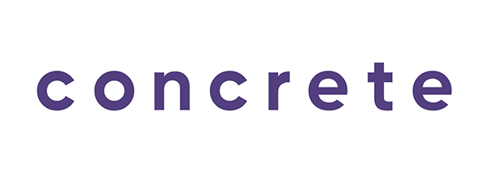
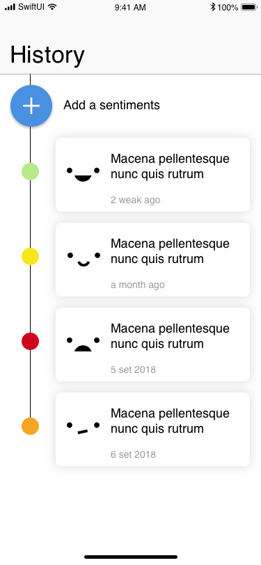
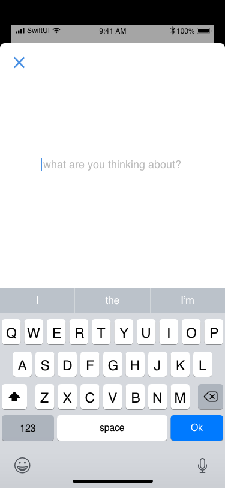
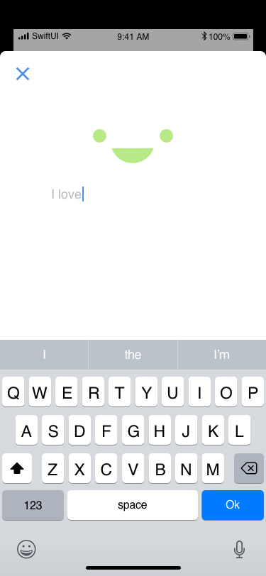

# NLPlay

---



## Bem-vindo

---

Obrigado por participar do dojo de SwiftUI da Concrete! Aqui você pode aprender com todos de uma forma mais rápida e interativa.

## Afinal, o que é esse desafio?

---

Desenvolveremos um aplicativo utilizando os frameworks da Apple: ```Natural Language``` e ```SwiftUI```. A ideia é fazer uma aplicação simples de forma que todos possam contribuir independente do conhecimento prévio de iOS.

- [Screenshots](assets)

Você var lidar com:

- Processamento de linguagem natural.
- Armazenamento local de textos.
- Estruturação de layout e fluxo de aplicação.

# Features

---

### Precisa ter:

- Tela de input modal de texto;
- Animação na tela de input de acordo com o texto digitado;
- Tela de histórico dos sentimentos;
- Armazenmaneto local.

# Exemplos e sugestões

---

Abaixo podemos ver algumas telas de exemplo de alguns desses fluxos. São apenas sugestões, fique à vontade para modificar como você quiser.

### Timeline



### Modal de input (idle)



### Modal de input (typing)



# Referências

---

- [SwiftUI Docs](https://developer.apple.com/documentation/swiftui)
- [Natural Language](https://martinmitrevski.com/2019/07/14/sentiment-analysis-with-natural-language-and-swiftui/?utm_campaign=AppCoda%20Weekly&utm_medium=email&utm_source=Revue%20newsletter)
- [Natural Language Docs](https://developer.apple.com/documentation/naturallanguage)

### **ATENÇÃO**

Não tente fazer o PUSH diretamente para ESTE repositório!